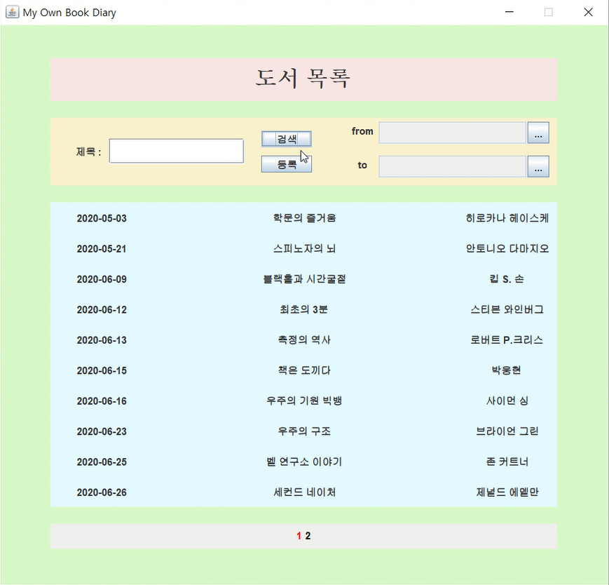

# 도서 목록 관리 시스템

### 개발 기간 
2020년 5월

### 주요 기능
1. 도서 정보 검색
    
1. 도서 정보 등록
1. 도서 정보 삭제
1. 시간 순서 나열
1. 도서명과 등록 날짜를 통한 필터링
1. 페이지 번호를 통해 10개씩 조회 가능

### 활용 기술
1. 네이버 검색 API
    - 키워드 검색을 통해 도서를 손쉽게 등록
    - 검색되지 않는 도서는 직접 입력하여 등록
1. 캘린더 UI
    - Github 오픈소스인 JDatePicker 사용 (https://github.com/JDatePicker/JDatePicker.git)
1. Maven
    - Maven Project로 빌드
    ```xml
    <dependency>
    	<groupId>net.sourceforge.jdatepicker</groupId>
    	<artifactId>jdatepicker</artifactId>
    	<version>1.3.2</version>
    </dependency>
    ```
1. 파일 IO
    - 프로그램 실행시 이전에 저장해놓은 데이터 로드
    
