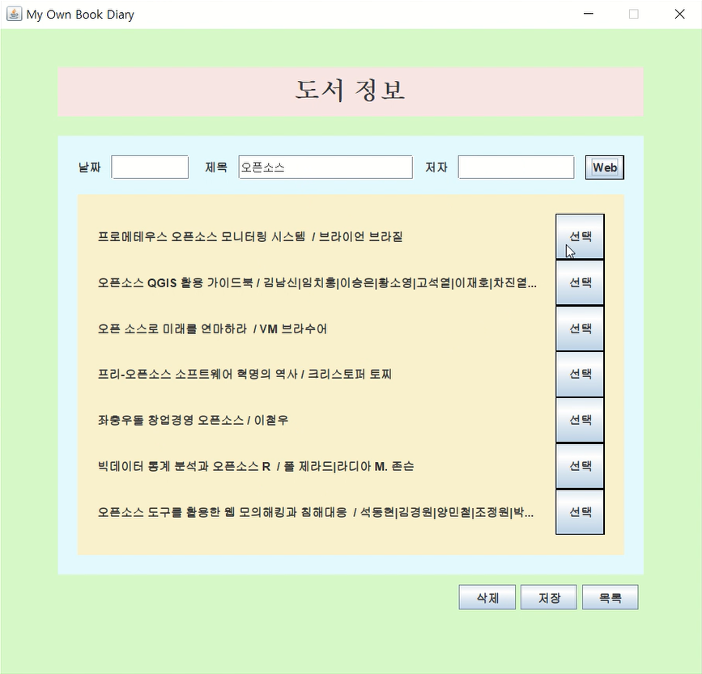
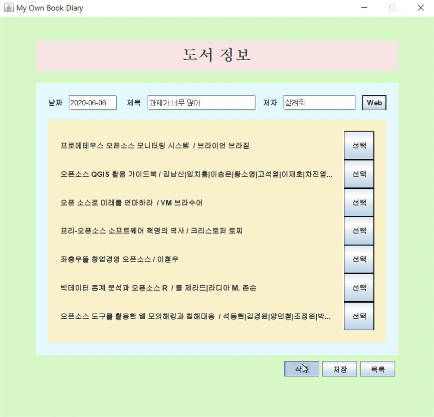
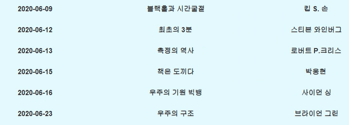
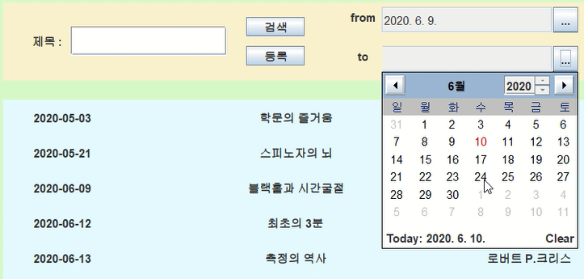
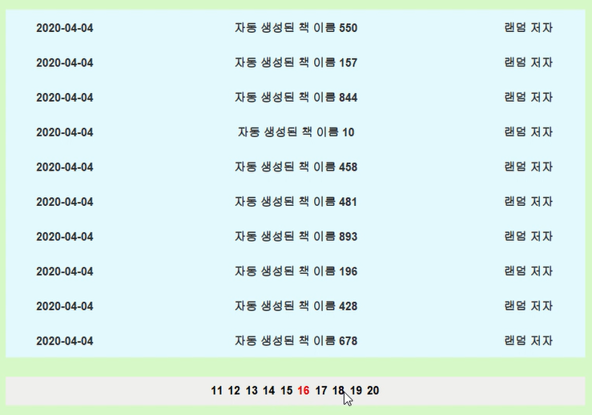
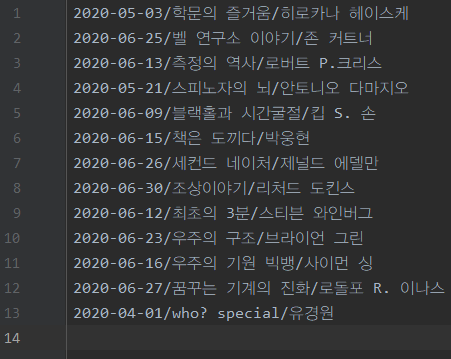

- **사용 스택** : JAVA, Java GUI Library(Swing, AWT), 네이버 API, Maven, Github
- **개발 기간** : 2020년 5월 20일 ~ 6월 10일
- **시연 영상** : [https://youtu.be/Sdp6CuFlObU](https://youtu.be/Sdp6CuFlObU)
- **프로젝트 내용 요약**
    - 도서 정보를 검색하고, 특정 도서를 선택해서 해당 도서 정보를 따로 보관할 수 있습니다.
    (메모장 파일 형태로 디스크에 저장)
    - 네이버 API를 사용해서 검색 결과를 받아와 활용합니다.
    - Maven Repository로부터 오픈 소스 라이브러리를 불러와 사용합니다.
- **어려웠던 점**
    - 게시판의 하단의 번호를 클릭해서 페이지를 이동하는 알고리즘을 구현하는 것이 매우 어려웠습니다.
- **느낀 점**
    - 오픈 API와 Maven을 사용하는 것이 처음이었다는 의미가 있었던 프로젝트였습니다.
    - 게시판을 사용하고자 할 때는 게시판을 직접 구현하지 말고, 오픈 소스를 사용해야겠다고 느꼈습니다.
    - 오픈 소스의 코드를 수정해서 사용하고 싶었으나, 읽기 모드 밖에 되지 않아 수정하지 못했는데, 다음에는 코드를 수정해서 사용하는 Customizing을 해보고 싶습니다.

---

# 도서 목록 관리 시스템

### 개발 기간 
2020년 5월

### 주요 기능
1. 도서 정보 검색  
    
1. 도서 정보 등록  
    
1. 도서 정보 삭제  
    
1. 시간 순서 나열  
    
1. 도서명과 등록 날짜를 통한 필터링  
    
1. 페이지 번호를 통해 10개씩 조회 가능  
    

### 활용 기술
1. 네이버 검색 API
    - 키워드 검색을 통해 도서를 손쉽게 등록
    - 검색되지 않는 도서는 직접 입력하여 등록
1. 캘린더 UI
    - Github 오픈소스인 JDatePicker 사용 (https://github.com/JDatePicker/JDatePicker.git)
1. Maven
    - Maven Project로 빌드
    ```xml
    <dependency>
    	<groupId>net.sourceforge.jdatepicker</groupId>
    	<artifactId>jdatepicker</artifactId>
    	<version>1.3.2</version>
    </dependency>
    ```
1. 파일 IO
    - 프로그램 실행시 이전에 저장해놓은 데이터 로드  
    
    
